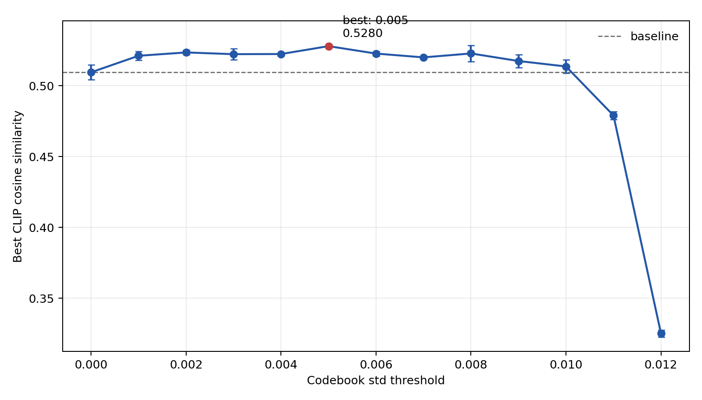

# PEZ-CFC: codebook-filtered candidates for hard-prompt optimization

[中文说明](README_zh-CN.md)

PEZ-CFC is a small research extension to
[Hard Prompts Made Easy (PEZ)](https://github.com/YuxinWenRick/hard-prompts-made-easy).
It filters the token candidates used by PEZ's nearest-neighbour projection with
a simple statistic from the CLIP token-embedding codebook. In an exploratory
sweep over eight images and three random seeds, the best tested threshold
raised mean best CLIP cosine similarity from **0.5095 to 0.5280**
(**+0.0185 absolute**).

This repository separates what was measured from what remains a hypothesis.
The result is promising but small-scale: the threshold was selected on the
same images used to report it, the images are not a standard benchmark, and
the optimizing CLIP model is also the evaluator.



## Research question

PEZ alternates between updating continuous prompt embeddings and projecting
them to the nearest discrete tokens. The projection searches the full token
codebook. Some CLIP token embeddings have very low coordinate-wise standard
deviation. The working hypothesis was that these candidates are less useful
projection targets and can consume a limited optimization budget.

PEZ-CFC asks a narrow question: **does restricting projection to tokens whose
embedding-coordinate standard deviation exceeds a threshold improve the PEZ
objective under an otherwise unchanged setup?**

The statistic is a **model-derived codebook prior**, not an external language
model and not a proof of token semantics. Low standard deviation does not
necessarily mean “meaningless,” and a retained token is not necessarily human
readable.

## Method and contribution

For token embedding matrix `W` and threshold `tau`, PEZ-CFC constructs

```text
candidate_ids = {i : std(W[i, :]) >= tau}
```

Each continuous prompt vector is normalized, matched by exact cosine
similarity against only those candidates, and mapped back to its original
vocabulary ID before the normal PEZ forward and gradient steps. The filtered
codebook is cached, so it is not rebuilt at every optimization step.

The project contribution is deliberately limited to:

1. the codebook-statistic candidate filter and correct original-ID mapping;
2. a reproducible threshold-sweep runner;
3. privacy-safe per-run results and scripts that regenerate the key table and
   figures; and
4. an explicit audit trail from the experiment implementation to the cleaned
   public implementation.

The underlying PEZ algorithm, model wrapper, and vendored `open_clip` code are
from the original PEZ project. See [NOTICE.md](NOTICE.md) and
[LICENSE](LICENSE).

## Key result

The experiment used 8 author-collected images, seeds 0/1/2, 3,000 PEZ steps,
prompt length 16, and CLIP `ViT-H-14` pretrained with
`laion2b_s32b_b79k`. There were 24 runs per threshold and 312 runs in total.

For every threshold, each seed was first averaged over the eight images. The
reported standard deviation is the sample standard deviation of those three
seed-level means. It is not the variation across all 24 individual runs.

| std threshold | Mean best CLIP similarity | Std. across seed means | Delta vs. baseline |
|---:|---:|---:|---:|
| 0.000 | 0.509497 | 0.005223 | +0.000000 |
| 0.001 | 0.521157 | 0.003105 | +0.011660 |
| 0.002 | 0.523512 | 0.001690 | +0.014015 |
| 0.003 | 0.522290 | 0.003857 | +0.012794 |
| 0.004 | 0.522394 | 0.001036 | +0.012897 |
| **0.005** | **0.527953** | **0.001239** | **+0.018456** |
| 0.006 | 0.522713 | 0.001667 | +0.013216 |
| 0.007 | 0.520026 | 0.000903 | +0.010529 |
| 0.008 | 0.522788 | 0.005841 | +0.013291 |
| 0.009 | 0.517464 | 0.004500 | +0.007967 |
| 0.010 | 0.513613 | 0.004635 | +0.004116 |
| 0.011 | 0.479014 | 0.002736 | -0.030483 |
| 0.012 | 0.325137 | 0.002383 | -0.184360 |

At `tau=0.005`, 46,164 of 49,408 tokens (93.4%) remain. Aggressive filtering
quickly becomes harmful: `tau=0.012` retains only 191 tokens (0.4%). This
supports a search-space trade-off, not the claim that “more filtering is
better.” The complete anonymous records and aggregation definition are in
[results/](results/README.md).

## Installation

The reported environment used Python 3.8.10, PyTorch 1.13.0 with its CUDA 11.7
runtime, and an NVIDIA RTX 2080 Ti. Python 3.8–3.10 is recommended for the
pinned legacy stack.

```bash
python -m venv .venv
source .venv/bin/activate
python -m pip install --upgrade pip
python -m pip install -r requirements.txt
```

The first optimization run downloads the selected OpenCLIP checkpoint. Model
weights are not stored in this repository.

## Run one optimization

Unfiltered PEZ baseline:

```bash
python run.py path/to/image.png --std-threshold 0 --seed 0
```

Filtered projection with the best threshold in the exploratory sweep:

```bash
python run.py path/to/image.png --std-threshold 0.005 --seed 0
```

For a quick installation smoke test, append `--iterations 2`. This checks the
execution path but does not produce a meaningful optimized prompt.

Configuration is read from `configs/pez_vit_h14.json`. Use `--config` to select
another JSON file. Do not assume `0.005` transfers to another model; the scale
of the embedding matrix and its standard deviations is model-specific.

## Run a threshold sweep

On Bash (Linux/macOS):

```bash
MAX_JOBS=1 bash scripts/run_threshold_sweep.sh image_a.png image_b.png
```

`MAX_JOBS`, `SEEDS`, `THRESHOLDS`, and `LOG_DIR` can be overridden through
environment variables. Parallel jobs multiply GPU memory use, so the safe
default is one.

Extract privacy-safe score records and regenerate the table/plot:

```bash
python scripts/extract_scores.py logs_sweep_YYYYMMDD_HHMMSS results/per_run_scores.csv
python -m pip install -r requirements-analysis.txt
python scripts/analyze_results.py
python scripts/plot_codebook_stats.py
python -m pytest -q
```

## Repository map

- `pezcfc/codebook.py`: candidate filtering and exact cosine projection.
- `optim_utils.py`, `run.py`, `open_clip/`: runnable PEZ integration.
- `scripts/`: sweep, log extraction, aggregation, and plotting.
- `results/`: anonymous scores, metadata, generated table, and figures.
- `reference/optim_utils_experiment.py`: snapshot named in the research notes;
  retained for code-to-result auditing, not as the recommended entry point.
- `tests/`: projection invariants and aggregation-definition tests.

## What is verified

- All 312 raw logs contain a final score and were converted to the checked-in
  anonymous score table.
- The analysis script regenerates the reported baseline, best threshold, and
  `+0.018456` difference from those records.
- Threshold zero produces the same projection IDs as the unfiltered codebook
  in unit tests.
- Filtered local indices map back to the original vocabulary IDs.
- The cleaned code compiles and the lightweight test suite passes in the local
  validation environment.
- A two-iteration GPU smoke test on the recorded RTX 2080 Ti environment
  loaded the checkpoint, kept 46,164 candidates at `0.005`, and completed
  forward, backward, projection, and optimizer steps.

## Limitations and open questions

- **No held-out threshold selection.** The best threshold is an in-sample
  exploratory choice and may overestimate its benefit.
- **Small, non-public convenience sample.** Eight images are insufficient for
  a general claim, and withholding them prevents exact rerunning of the GPU
  experiment from this repository alone. The result analysis itself is fully
  reproducible from the anonymous scores.
- **Self-evaluation with CLIP.** The same CLIP family supplies the optimization
  objective, filter statistic, and reported metric. Better CLIP similarity is
  not automatically better prompt readability or text-to-image quality.
- **Std is only a proxy.** It does not directly measure frequency, semantic
  quality, naturalness, or whether a token was “well trained.” Those mechanism
  claims remain hypotheses.
- **Model dependence.** The threshold is tied to the evaluated codebook scale;
  transfer to another CLIP checkpoint or tokenizer is untested.
- **Reproducibility limits.** CUDA kernels and legacy library versions may not
  be bitwise deterministic across hardware.
- **Missing comparisons.** This experiment does not establish superiority to
  language-model priors or interpretability-focused prompt optimizers, which
  use additional signals and different settings.

## Citation and upstream work

If this code is useful, cite the original PEZ paper:

> Yuxin Wen, Neel Jain, John Kirchenbauer, Micah Goldblum, Jonas Geiping, and
> Tom Goldstein. “Hard Prompts Made Easy: Gradient-Based Discrete Optimization
> for Prompt Tuning and Discovery.” NeurIPS 2023.

- Paper: https://arxiv.org/abs/2302.03668
- Official implementation: https://github.com/YuxinWenRick/hard-prompts-made-easy
